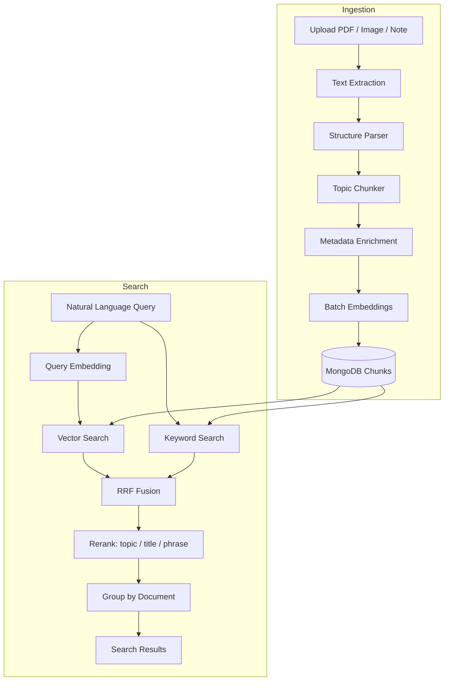

# Topic-Based Indexing Architecture

Production-grade retrieval design for the Digital Memory Search Engine — topic-aware chunking, hierarchical metadata, hybrid search, and MongoDB vector optimization.

## Architecture Diagram



## Hierarchy Model

```
Document (React Notes)
├── Topic (Hooks)
├── Topic (Memoization)
│   ├── Subtopic (useMemo)     → semantic chunk + embedding
│   └── Subtopic (useCallback) → semantic chunk + embedding
└── Topic (Context API)
```

Each **semantic chunk** stores:
- `parentChunkIndex` / `parentChunkId` for tree navigation
- `sectionPath`: `["React Notes", "Memoization", "useMemo"]`
- `level`: `topic | subtopic | semantic`

## Folder Structure

```
server/src/
├── types/
│   ├── chunking.ts          # TopicChunk, ParsedSection types
│   └── embedding.ts         # VectorMetadata, hybrid search types
├── services/
│   ├── chunking/
│   │   ├── structureParser.ts       # Headings, sections, bullets
│   │   ├── topicChunkingService.ts  # Topic-aware chunk creation
│   │   └── chunkSplitter.ts         # Token-limit splitting
│   ├── enrichment/
│   │   └── chunkEnrichmentService.ts # Summary, keywords, tags
│   ├── search/
│   │   └── hybridSearchService.ts   # RRF vector + keyword fusion
│   ├── indexingService.ts           # Full index pipeline
│   ├── searchService.ts             # Hybrid search pipeline
│   ├── rankingService.ts            # Topic/title/phrase reranking
│   ├── embeddingService.ts          # Batch embeddings + retries
│   └── vectorStoreService.ts        # MongoDB + Atlas vector search
├── models/
│   └── Chunk.ts                     # Rich chunk schema
└── scripts/
    └── createVectorIndexes.ts       # Index setup helper
```

## Chunking Strategy

| Stage | Behavior |
|-------|----------|
| **Structure detection** | Markdown `#`, numbered headings, ALL-CAPS titles, bullet groups |
| **Topic grouping** | One chunk per section; content stays with its heading |
| **Boundary preservation** | Topics never split unless token limit exceeded |
| **Oversized topics** | Split at paragraph → sentence boundaries |
| **Embedding text** | `Topic + Subtopic + Title + Summary + Keywords + Content` |

### Example

**Input:**
```markdown
## Memoization
Memoization avoids unnecessary re-renders.

### useMemo
Caches expensive computations.
```

**Output chunks:**
1. `{ topic: "Memoization", title: "Memoization", sectionPath: ["Doc", "Memoization"] }`
2. `{ topic: "Memoization", subtopic: "useMemo", sectionPath: ["Doc", "Memoization", "useMemo"] }`

## MongoDB Chunk Schema

```typescript
{
  documentId: ObjectId,
  userId: ObjectId,
  chunkIndex: number,
  vectorId: string,
  text: string,              // raw content
  searchableText: string,    // enriched text for $text search
  embedding: number[],
  embeddingModel: string,
  tokenCount: number,
  topic: string,
  subtopic?: string,
  title: string,
  summary: string,
  keywords: string[],
  concepts: string[],
  tags: string[],
  sourceType: "pdf" | "image" | "note",
  sectionPath: string[],
  contentPreview: string,
  level: "document" | "topic" | "subtopic" | "semantic",
  parentChunkId?: ObjectId,
  parentChunkIndex?: number,
  metadata: Record<string, unknown>,
  createdAt: Date,
  updatedAt: Date
}
```

### Indexes

| Index | Purpose |
|-------|---------|
| `{ documentId, chunkIndex }` unique | Chunk ordering |
| `{ userId, topic }` | Topic filter |
| `{ userId, tags }` | Tag filter |
| Text index on title, topic, keywords, tags, summary | Keyword search |
| Atlas `vectorSearch` on `embedding` | ANN semantic search |

## Search Pipeline

1. **Vector retrieval** — cosine similarity (or Atlas `$vectorSearch`)
2. **Keyword retrieval** — MongoDB `$text` on enriched fields
3. **RRF fusion** — `score = 0.6/(60+rank_v) + 0.4/(60+rank_k)`
4. **Reranking** — boosts for topic match, title match, exact phrases
5. **Grouping** — aggregate top chunks per document for UI

### Query Example

```
Query: "What did I learn about memoization?"
```

**Expected behavior:**
- Keyword hit on `topic: Memoization`, `keywords: [memoization, usememo]`
- Vector hit on embedding text containing topic context
- Topic boost pushes Memoization chunks above unrelated React sections
- Returns `useMemo` and `useCallback` subtopic chunks first

## Embedding Pipeline

| Feature | Implementation |
|---------|----------------|
| Model | `gemini-embedding-001` |
| Document task | `RETRIEVAL_DOCUMENT` |
| Query task | `RETRIEVAL_QUERY` |
| Batch size | 8 concurrent (configurable) |
| Retries | 3× exponential backoff on 429/502/503 |
| Re-index | `POST /api/documents/:id/reindex` |
| Per-chunk errors | Partial index with error summary |

## Best Practices (Notion AI / Perplexity / ChatGPT Memory)

| Practice | Our implementation |
|----------|---------------------|
| Structure-aware chunking | Markdown/heading parser |
| Contextual embedding prefix | Topic + summary prepended to embed text |
| Hybrid retrieval | Vector + BM25-style `$text` + RRF |
| Metadata filtering | topic, tags, document type, date |
| Hierarchical memory | sectionPath + parentChunkId |
| Query-time reranking | Topic/title/phrase composite score |
| Partial re-index | Per-chunk error isolation |

## Migration Steps

1. Update `.env` with `CHUNK_MAX_TOKENS=512`
2. Run `npx ts-node src/scripts/createVectorIndexes.ts`
3. **Re-index all documents** — existing fixed-size chunks lack topic metadata
4. (Optional) Enable Atlas: `MONGODB_USE_ATLAS_VECTOR=true`

## API Changes

Search results now include per-chunk topic metadata:

```json
{
  "matchedChunks": [{
    "chunkIndex": 3,
    "score": 0.87,
    "topic": "Memoization",
    "subtopic": "useMemo",
    "title": "useMemo",
    "sectionPath": ["React Notes", "Memoization", "useMemo"]
  }],
  "topTopic": "Memoization",
  "topSubtopic": "useMemo"
}
```

Optional query params: `topic`, `tag` for metadata filtering.
